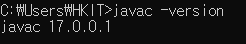

<a href="../readme.md">목차로 이동</a>

# 01-1 프로그래밍 언어와 자바
---
## 자바 설치 확인
- 설치 확인법 - 터미널이나 cmd 창에서 `javac -version` 입력후 버전 글자 출력되는지 확인

---
## 핵심 포인트 정리

- **기계어** : 컴퓨터(운영체제)가 이해하고 실행할 수 있는 0과 1로 이루어진 코드를 말합니다.  
> 요약: 사람이 쓰기 어려워서 프로그래밍 언어가 필요하다.

- **프로그래밍 언어** : 사람이 기계어를 이해하는 것은 매우 어렵기 때문에 사람의 언어와 기계어의 다리 역할을 합니다. 종류로는 C, C++, 자바(Java), 파이썬(Python)등이 있습니다.  
> 요약: 사람이 쓰는 언어, 실행하려면 변환 과정이 필요하다.

- **소스 파일** : 프로그래밍 언어로 작성된 파일을 말합니다.
> 요약: 사람이 작성하는 원본 코드(.java).

- **컴파일** : 소스 파일을 기계어로 번역하는 것을 말합니다. 이 역할을 담당하는 소프트웨어를 컴파일러라고 합니다.  
> 요약: `.java` → `.class`로 바꿔주는 과정.

- **JDK** : 자바 개발 도구(Java Development Kit)의 줄입말로, 자바로 프로그램을 개발할 수 있는 실행 환경(JVM)과 개발 도구(컴파일러) 등을 제공합니다.  
> 요약: 자바 개발용 도구 모음.

- **환경 변수** : 운영체제가 실행하는 데 필요한 정보를 제공해주는 변수를 말합니다. JKD를 설치한 후 명령 라인(명령 프롬프트, 터미널)에서 컴파일러(javac)와 실행(java) 명령어를 사용하러면 JAVA_HOME 환경 변수를 등록하고 Path 환경 변수를 수정하는 것이 좋습니다.
> 요약: 명령어를 어디서든 실행할 수 있게 해주는 설정.

---

## 예제 코드
- [Hello.java](../code-examples/chap01_1/Hello.java) - 텍스트 표시 확인
- [CheckPath.java](../code-examples/chap01_1/CheckPath.java) - 환경변수(Path)가 잘 등록되었는지 확인

## 실행 결과
- Hello.java -   
- CheckPath.java - 

---

## 확인 문제

### 1. 다음 중 맞는 것에 O표, 틀린 것에 X표 하세요.
1. 소스 파일은 컴퓨터가 이해하는 기계어 파일이다. (X)  
   > 소스 파일은 사람이 작성하는 코드 .java 파일 / 기계어는 컴파일된 .class 파일  
2. 자바 언어로 프로그램을 개발하려면 JDK가 필요하다. (O)  
3. JDK를 설치하면 기본적으로 `C:\Program Files\Java` 폴더가 생성된다. (O)  
4. 자바 컴파일러와 실행 명령은 JDK 설치 폴더의 bin 폴더에 들어 있다. (O)  

---

### 2. JDK 설치 폴더 안의 bin 폴더를 Path 환경 변수에 등록하는 이유는 무엇입니까?
1. 자바 소스 파일(.java)을 자동으로 생성하기 위해 ⇒ 소스 파일은 직접 작성해야 함  
2. 자바 소스 파일을 컴파일하지 않고도 실행하기 위해 ⇒ 자바 소스는 컴파일을 해야 실행됨  
3. **<u>명령 프롬프트나 터미널 어디에서나 javac, java 명령을 실행하기 위해 - 정답</u>**  
4. JDK 자체를 삭제하지 않도록 보호하기 위해 ⇒ 환경변수 등록은 삭제와 무관

<a href="#top">위로 이동</a> 