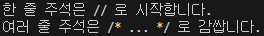
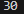

# 01-3 자바 프로그램 실행 과정

## 핵심 포인트 정리

- 바이트 코드 파일: 자바 소스 파일을 javac 명령어로 컴파일한 파일을 말합니다.  
> 요약: 자바 소스를 컴파일하면 `.class` 바이트 코드가 생성된다.

- JVM: 자바 가상 기계(Java Virtual Machine)는 바이트 코드 파일을 운영체제를 위한 완전한 기계어로 번역하고 실행하는 역할을 합니다. JVM은 java 명령어에 의해 구동됩니다.  
> 요약: 바이트 코드를 실제 실행하는 가상 컴퓨터.

- 클래스 선언: 자바 소스 파일은 클래스 선언부와 클래스 블록으로 구성됩니다. 이렇게 작성하는 것을 클래스 선언이라고 합니다.  
> 요약: 자바 프로그램은 클래스 단위로 작성된다.

- main() 메소드: java 명령어로 바이트 코드 파일을 실행하면 제일 먼저 main() 메소드를 찾아 블록 내부를 실행합니다. 그래서 main() 메소드를 프로그램 실행 진입점(entry point)이라고 부릅니다.  
> 요약: 프로그램 실행은 main() 메소드부터 시작된다.

- 주석: 주석은 프로그램 실행과는 상관없이 코드에 설명을 붙인 것을 말합니다. 주석은 컴파일 과정에서 무시되고 실행문만 바이트 코드로 번역됩니다.  
> 요약: 실행되지 않고 코드 설명용으로만 사용된다.

- 실행문: 변수 선언, 값 저장, 메소드 호출에 해당하는 코드를 말합니다. 실행문 끝에는 세미콜론(;)을 붙여야 합니다.  
> 요약: 실제 동작을 담당하는 코드, 반드시 세미콜론으로 끝난다.

---

## 예제 코드

- [Hello.java](../code-examples/01-3/Hello.java)
- [CommentExample.java](../code-examples/01-3/CommentExample.java) - 문제 3번 예제 
- [StatementExample.java](../code-examples/01-3/StatementExample.java) - 변수선언, 값 계산 예제(64p)

## 실행 결과

- 
- 
- 

---

## 확인 문제

### 1. 자바 프로그램 개발 과정을 순서대로 적어보세요.
① javac 명령어로 컴파일한다.  
> 설명: 작성된 소스를 바이트코드(.class)로 변환하는 단계

② 소스 파일(~.java)을 작성한다.  
> 설명: 사람이 읽고 쓰는 코드 작성 단계

③ java 명령어로 실행한다.  
> 설명: JVM을 통해 .class를 실행하는 단계

④ 실행 결과를 확인한다.  
> 설명: 출력/동작을 눈으로 검증하는 단계

**정답 순서: 2 → 1 → 3 → 4** 

---

### 2. 자바 소스에 대한 설명 (맞으면 O, 틀리면 X)
1) 컴파일하면 클래스 선언부와 클래스 블록은 바이트 코드 파일이 생성된다. ( **O** )  

2) main() 메소드는 반드시 클래스 블록 내부에서 작성해야 한다. ( **O** )  

3) main() 메소드를 작성하지 않으면 중괄호 블록을 만들지 않아도 된다. ( **X** )  
> 설명: 클래스는 항상 **중괄호 블록**으로 정의해야 한다.

4) 컴파일된 소스를 실행하려면 반드시 main() 메소드가 있어야 한다. ( **O** )  

---

### 3. 주석에 대한 설명 (맞으면 O, 틀리면 X)
1) `//` 기호 뒤 라인 내용은 모두 주석이 된다. ( **O** )  

2) `/*`부터 시작해서 `*/`까지 모든 내용이 주석이 된다. ( **O** )  

3) 주석이 많으면 바이트 코드 파일의 크기가 커지므로 꼭 필요할 경우에만 작성한다. ( **X** )  
> 설명: 주석은 **컴파일 시 제거**되어 .class 크기에 영향을 주지 않는다.

4) 문자열 안에는 주석을 만들 수 없다. ( **O** )  

---

### 4. 이클립스의 자바 프로젝트에 대한 설명 (맞으면 O, 틀리면 X)
1) 기본적으로 소스 파일과 바이트 코드 파일이 저장되는 폴더가 다르다. ( **O** )  

2) 자바 소스 파일을 작성하는 폴더는 src이다. ( **O** )  

3) 선언되는 클래스 이름은 소스 파일 이름과 달라도 상관없다. ( **X** )  
> 설명: `public` 클래스명은 **파일명과 동일**해야 한다.

4) 올바르게 작성된 소스 파일을 저장하면 자동으로 컴파일되고, 바이트 코드 파일이 생성된다. ( **O** )  

---

### 5. 이클립스에서 바이트 코드 파일을 실행하는 방법(모두 선택)
1) Package Explorer에서 **소스 파일**을 더블클릭한다.
> 설명: 더블클릭은 **열기**일 뿐 실행이 아니다.

2) Package Explorer에서 **바이트 코드 파일**을 선택하고, 툴바에서 **Run** 아이콘을 클릭한다.
> 설명: 교재 기준 **정석 실행 절차**로 보지 않는다.

3) **Package Explorer에서 소스 파일을 선택하고, 툴바에서 Run 아이콘을 클릭한다.**

4) **Package Explorer에서 소스 파일을 우클릭 → Run As → Java Application을 선택한다.**

**- 정답: 3, 4**
