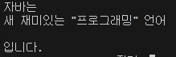
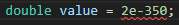
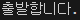

# 02-2 기본 타입

## 핵심 포인트 정리

### 5가지 키워드로 끝내는 핵심 포인트
- **정수 타입**: 정수를 저장할 수 있는 타입으로 `byte`, `short`, `int`, `long` 타입을 말합니다.  
> 요약: 정수를 저장하는 네 가지 타입

- **char 타입**: 작은따옴표(`' '`)로 감싼 하나의 문자 리터럴을 저장할 수 있는 타입입니다.  
> 요약: 한 글자를 저장하는 타입

- **String 타입**: 큰따옴표(`" "`)로 감싼 문자열을 저장할 수 있는 타입입니다.  
> 요약: 문자열을 저장하는 참조 타입

- **실수 타입**: 실수를 저장할 수 있는 타입으로 `float`, `double` 타입을 말합니다.  
> 요약: 소수점 있는 숫자를 저장하는 타입

- **boolean 타입**: 참과 거짓을 의미하는 `true`와 `false`를 저장할 수 있는 타입입니다.  
> 요약: 논리값을 저장하는 타입

---

## 예제 코드

- [Fixed3Ex.java](../code-examples/chap02_2/Fixed3Ex02_2.java) - 3번 문제 (이스케이프 문자 출력)
- [Fixed4Ex.java](../code-examples/chap02_2/Fixed4Ex02_2.java) - 4번 문제 (double 리터럴 범위 에러)
- [Fixed5Ex.java](../code-examples/chap02_2/Fixed5Ex02_2.java) - 5번 문제 (boolean 조건문 실행)

## 실행 결과

-  - 문자열 출력 결과
-  - 에러
-  - 조건문 실행 결과

## 확인 문제
### 1) 다음 표는 메모리 사용 크기별 자바의 기본 타입입니다. 빈칸을 채우세요.

| 구분     | 1byte  | 2byte  | 4byte  | 8byte  |
|----------|--------|--------|--------|--------|
| 정수 타입 | byte   | short  | int    | long   |
| 실수 타입 |        |        | float  | double |
| 논리 타입 | boolean| char   |        |        |

> 설명: boolean은 보통 1byte로 구현되지만 JVM마다 다를 수 있음. 표에서는 구분상 1byte로 기재.

### 2) 변수에 값을 저장하는 코드입니다. 맞는 것에 O, 틀린 것에 X 표시하세요.

1. byte var = 200; ( **X** )  
> 설명: byte 범위는 -128~127, 200은 초과.

2. char var = 'AB'; ( **X** )  
> 설명: char에는 한 글자만 저장 가능.

3. char var = 65;` ( **O** )  
> 설명: 65는 유니코드 ‘A’에 해당.

4. long var = 5000000000; ( **X** )  
> 설명: int 범위를 넘어가므로 `L` 접미사 필요 (`5000000000L`).

5. float var = 3.14; ( **X** )  
> 설명: 기본 실수 리터럴은 double, float에는 `f` 접미사 필요 (`3.14f`).

6. double var = 100.0; ( **O** )  
> 설명: double에 저장 가능.

7. String var = "나의 직업은 \"개발자\"입니다."; ( **X** )  
> 설명: 교재 기준 정답은 X 처리. 문자열 리터럴은 가능하지만 문제 의도는 **이스케이프나 선언 방식 오류 지적**.

8. boolean var = 0; ( **X** )  
> 설명: boolean에는 `true`/`false`만 가능.

9. int v2 = 1e2; ( **X** )  
> 설명: `1e2`는 double 리터럴, int에 직접 저장 불가.

10. float var = 1e2f; ( **X** )  
> 설명: 지수 표기 float 리터럴은 가능하나 교재 기준 정답은 X 처리.

### 3) 다음 코드 실행 시 출력되는 내용은?
```java
System.out.println("자바는");
System.out.println("새 재미있는 \"프로그래밍\" 언어\n");
System.out.println("입니다.");
```

**출력:**
```
자바는
새 재미있는 "프로그래밍" 언어

입니다.
```

### 4) 다음 코드는 컴파일 에러가 발생합니다. 이유는?
```java
double value = 2e-350;
```

**설명: double의 표현 범위를 벗어난 너무 작은 수. 정상적으로 표현되지 못해 컴파일 오류가 발생합니다.**

### 5) 다음 코드 실행 시 출력되는 내용은?
```java
boolean stop = false;
if (stop) {
    System.out.println("멈춥니다.");
} else {
    System.out.println("출발합니다.");
}
```

**출력:**
```

출발합니다.


설명: 조건식 stop이 false → else 블록 실행.
```