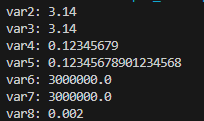
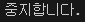

<p align="right"><a href="../readme.md">목차로 이동</a></p>

# 02-2 기본 타입

---

## 기본 타입 분류와 종류
|구분|저장되는 값에 따른 분류|타입의 종류|
|---|-----------------------|----------|
||정수 타입|byte, char, short, int, long|
|기본 타입|실수 타입|float, double|
||논리 타입|boolean|


## 정수 리터럴
소스 코드에서 프로그래머에 의해 직접 입력된 값을 `리터럴(literal)`이라고 부름.  
입력된 리터럴 중에 자바가 정수로 인식하는 경우는 아래와 같음

**2진수:** 0b 또는 0B로 시작하고 0과 1로 구성
```
0b1011  >> 1x2³ + 0x2² + 1x2¹ + 1x2⁰        >> 11
0b10100 >> 1x2⁴ + 0x2³ + 1x2² + 0x2¹ + 0x2⁰ >> 20
```
**8진수:** 0으로 시작하고 0~7 숫자로 구성
```
013  >> 1x8¹ + 3x8⁰        >> 11
0206 >> 2x8² + 0x8¹ + 6x8⁰ >> 134
```
**10진수:** 소수점이 없는 0~9 숫자로 구성
```
12
365
```
**16진수:** 0x 또는 0X로 시작하고 0~9 숫자와 A,B,C,D,E,F 또는 a,b,c,d,e,f로 구성
```
0xB3   >> 11x16¹ + 3x16⁰                  >> 179
0x2A0F >> 2x16³ + 10x16² + 0x16¹ + 15x16⁰ >> 10767
```

>예제 코드 `Ex83p.java` 참고

## Long 타입 변수
은행이나 과학과 관련된 프로그램에서 **수치가 큰 데이터**를 다룰때 주로 사용됨.  
컴파일러는 정수 리터럴을 **기본적으로 int로 간주**하는데 int타입의 **허용 범위**`-2,147,483,648~2,147,483,647`을 **초과**할 경우 **long 타입**임을 컴파일러에 알려줘야함.  
>예제 코드 `Ex84p.java` 참고
## char 타입
작은따옴표(')로 감싼 것을 **문자 리터럴**이라고 함  
문자 리터럴은 **유니코드**로 변환되어 저장  
유니코드는 세계 각국의 문자를 2byte로 표현할 수 있는 숫자`0~65535`로 매핑한 국제 표준 규약  
자바에서는 유니코드를 저장할 수 있도록 **2byte** 크기인 **char 타입**이 존재

**예시:** 'A', 'B', '가', '각' 문자를 char 변수에 저장할 경우의 유니코드 
```java
char var1 = 'A';  //유니코드: 65
char var2 = 'B';  //유니코드: 66
char var3 = '가'; //유니코드: 44032
char var4 = '각'; //유니코드: 44033
```
유니코드는 정수라서 char도 정수 타입에 속함. 10진수 or 16진수 형태로 저장가능  
**예시**
```java
char c = 65;     //10진수
char c = 0x0041; //16진수
```

### 문자 리터럴을 int 타입에 저장할 경우
작은따옴표(')로 감싼 문자 리터럴은 유니코드로 변환되기에 int 타입 변수에도 저장 가능.  
char 타입 변수에 저장하면 자동으로 문자로 매핑되어 출력되지만, int 타입 변수에 저장하면 유니코드 자체가 출력됨
```java
char var1 = 'A';
int var2 = 'A';
System.out.println(var1); //A를 출력
System.out.println(var2); //65를 출력
```
>예제 코드 `Ex86p.java` 참고

## String 타입
작은따옴표(')로 감싼 문자는 char 타입 변수에 저장되어 유니코드로 저장되만, 큰따옴표(")로 감싼 문자 또는 여러 개의 문자들은 유니코드로 변환되지 않습니다.

**잘못된 코딩 예**

```java
char var1 = "A";
char var2 = "홍길동";
```

큰따옴표(")로 감싼 문자를 자바에서는 **문자열**이라고 부름.  
작은따옴표와 큰따옴표는 컴파일러가 문자 리터럴과 문자열 리터럴을 구별하는 기호로 사용.  
문자열을 변수에 저장하고 싶다면 아래와 같이 **String 타입**을 사용해야 함.

**올바른 코딩 예**
```java
String var1 = "A";
String var2 = "홍길동";
```

>참고 : String타입은 기본 타입이 아님.  
>예제 코드 `Ex87p.java` 참고

**이스케이프 문자**
문자열 내부에 역슬래시(\)가 붙은 문자를 사용할수있는데 이것을 이스케이프 문자라고 함.  
이것을 사용하면 문자열 내부에 특정 문자를 포함시킬 수 있음.  
예를 들어 `"`는 문자열 식별 기호인데 이 문자 자체를 출력하고 싶을때 이스케이프 문자`\`를 사용함.
**예시**
```java
String str = "나는 \"자바\"를 좋아합니다.";
System.out.println(str);

출력 >> 나는 "자바"를 좋아합니다.
```

`\`안에 넣는다는 개념이 아니라 표시하고 싶은 특정 문자 앞에 `\`를 붙이면 됨.  
특정 문자 앞마다 개별로 `\`를 붙여야함.
`\"자바"\` - 잘못된 예
`\"자바\"` - 올바른 예
또한 이스케이프 문자를 사용하여 출력을 제어할 수 있음.  
탭만큼 띄우기 `\t`  
개행(한 줄 내리기) `\n` 등등
```java
// 탭 띄우기(\t) 예시
String str = "번호\t이름\t나이";
System.out.println(str);

출력 >> 번호 <-tab 공간-> 이름 <-tab 공간-> 나이
```
```java
// 개행 (\n) 예시
String str = "홍길동\n감자바";
System.out.println(str);

출력 >> 홍길동
        감자바
```

**아래는 자주 사용하는 이스케이프 문자를 정리한 표**
|이스케이프 문자|출력 용도|
|--------------|---------|
|`\t`          |탭만큼 띄움|
|`\n`          |줄 바꿈(라인 피드)|
|`\r`          |캐리지리턴|
|`\"`          |`"`출력|
|`\'`          |`'`출력|
|`\\`          |`\`출력|
|`\u16진수`    |16진수 유니코드에 해당하는 문자 출력|
>예제 코드 `Ex88p.java` 참고

## 실수 타입
|타입|메모리 |사용 크기| 저장되는 값의 허용 범위(양수 기준)| 정밀도(소수점 이하 자리)|
|-------------|------|---|----------------------------------|-----------------------|
|float|4byte|32bit|(1.4x10⁻⁴⁵)~(3,4x10³⁸)|7자리|
|double|8byte|64bit|(4.9x10⁻³²⁴)~(1.8x10³⁰⁸)|15자리|
>복붙용 `⁻ ⁰ ¹ ² ³ ⁴ ⁵ ⁶ ⁷ ⁸ ⁹`

**실수 리터럴**
소스 코드에서 소수점이 있는 숫자 리터럴은 10진수 실수로 인식

```
0.25, -3.14
```

또한 알파벳 소문자 e 또는 대문자 E가 포함되어 있는 수수자 리터럴은 지수와 가수로 표현된 소수점이 있는 10진수 실수로 인식

```
5e2     >> 5.0 x 10² = 500.0
0.12E-2 >> 0.12 x 10⁻² = 0.0012
```

자바는 실수 리터럴을 기본적으로 `double` 타입으로 해석하기 때문에 `double` 타입 변수에 저장해야 함.  
실수 리터럴을 `float` 타입 변수에 저장하면 컴파일 에러가 발생

```java
float var = 3.14; //컴파일 에러(Type mismatch: cannot convert from double to float)
double var = 3.14;
double var = 314e-2;
```

실수 리터럴을 `float` 타입으로 저장하고 싶다면 리터럴 뒤에 소문자 `f`나 대문자 `F`를 붙여 컴파일러가 `float` 타입임을 알 수 있도록 해야 함

```java
float var = 3.14; //컴파일 에러 (Type mismatch: cannot convert from double to float)
float var = 3.14f;
float var = 3E6F;
```
`float` 타입과 `double` 타입이 허용하는 소수점 이하 자리는 각각 7자리와 15자리  
`double` 타입은 `float` 타입보다 2배 정도 정밀도가 높아서 더욱 정확한 데이터 저장이 가능.

>`double`이라는 이름은 `float` 타입보다 약 2배의 정밀도를 갖는다는 의미에서 붙여진 것.  
>메모리에 여유가 있고 특별한 이유가 없는 한 실수 리터럴을 저장할 때에는 `double` 타입을 사용하는 것이 좋음.  
>예제 코드 `Ex90p.java` 참고

## 논리 타입
자바는 참과 거짓을 의마하는 논리 리터럴로 `true`와 `false`를 사용함.  
논리 리터럴은 아래와 같이 `1byte` 크기의 `boolean` 타입 변수에 저장할 수 있음.  
```java
boolean stop = true;
boolean state = false;
```  
`boolean` 타입 변수는 주로 두 가지 상태값에 따라 조건문과 제어문의 실행 흐름을 변경하는데 사용.  

**예제 코드:**`Ex91p.java`를 참고하면 `stop`변수가 `true`값을 가지고 있기 때문에 `if` 블록이 실행되어 "중지합니다."가 출력됨.  
만약 `stop` 변수가 `false` 값을 가지고 있다면 `else` 블록이 실행되어 "시작합니다."를 출력함.  
>예제 코드 `Ex91p.java` 참고

---

## 핵심 포인트 정리

### 5가지 키워드로 끝내는 핵심 포인트
- **정수 타입**: 정수를 저장할 수 있는 타입으로 `byte`, `short`, `int`, `long` 타입을 말합니다.  
> 요약: 정수를 저장하는 네 가지 타입

- **char 타입**: 작은따옴표(`' '`)로 감싼 하나의 문자 리터럴을 저장할 수 있는 타입입니다.  
> 요약: 한 글자를 저장하는 타입

- **String 타입**: 큰따옴표(`" "`)로 감싼 문자열을 저장할 수 있는 타입입니다.  
> 요약: 문자열을 저장하는 참조 타입

- **실수 타입**: 실수를 저장할 수 있는 타입으로 `float`, `double` 타입을 말합니다.  
> 요약: 소수점 있는 숫자를 저장하는 타입

- **boolean 타입**: 참과 거짓을 의미하는 `true`와 `false`를 저장할 수 있는 타입입니다.  
> 요약: 논리값을 저장하는 타입

---

## 예제 코드
- [Ex83p.java](../code-examples/chap02_2/Ex83p.java) - 정수 리터럴 여러 값을 10진수로 출력
- [Ex84p.java](../code-examples/chap02_2/Ex84p.java) - long 타입 변수
- [Ex86p.java](../code-examples/chap02_2/Ex86p.java) - char 타입
- [Ex87p.java](../code-examples/chap02_2/Ex87p.java) - String 타입
- [Ex88p.java](../code-examples/chap02_2/Ex88p.java)
- [Ex90p.java](../code-examples/chap02_2/Ex90p.java)
- [Ex91p.java](../code-examples/chap02_2/Ex91p.java)
- [Fixed3Ex.java](../code-examples/chap02_2/Fixed3Ex02_2.java) - 3번 문제 (이스케이프 문자 출력)
- [Fixed4Ex.java](../code-examples/chap02_2/Fixed4Ex02_2.java) - 4번 문제 (double 리터럴 범위 에러)
- [Fixed5Ex.java](../code-examples/chap02_2/Fixed5Ex02_2.java) - 5번 문제 (boolean 조건문 실행)

## 실행 결과
-  - Ex83p
-  - Ex84p
-  - Ex86p
-  - Ex87p
-  - Ex88p
-  - Ex90p
-  - Ex91p
-  - 3번
-  - 4번
-  - 5번

## 확인 문제
### 1) 다음 표는 메모리 사용 크기별 자바의 기본 타입입니다. 빈칸을 채우세요.

ㅣ 구분     | 1byte  | 2byte         | 4byte  | 8byte  |
|----------|--------|---------------|--------|--------|
| 정수 타입 | byte   | short / char  | int    | long   |
| 실수 타입 |        |               | float  | double |
| 논리 타입 | boolean|               |        |        |

> 설명: boolean은 보통 1byte로 구현되지만 JVM마다 다를 수 있음. 표에서는 구분상 1byte로 기재.

### 2) 변수에 값을 저장하는 코드입니다. 맞는 것에 O, 틀린 것에 X 표시하세요.

1. byte var = 200; ( **X** )  
> 설명: byte 범위는 -128~127, 200은 초과.

2. char var = 'AB'; ( **X** )  
> 설명: char에는 한 글자만 저장 가능.

3. char var = 65; ( **O** )  
> 설명: 65는 유니코드 ‘A’에 해당.

4. long var = 5000000000; ( **X** )  
> 설명: int 범위를 넘어가므로 `L` 필요 (예-`5000000000L`).

5. float var = 3.14; ( **X** )  
> 설명: 기본 실수 리터럴은 double, float에는 `f` 접미사 필요 (`3.14f`).

6. double var = 100.0; ( **O** )  
> 설명: double에 저장 가능.

7. String var = "나의 직업은 \"개발자\"입니다."; ( **X** )  
> 설명: 교재 기준 정답은 X 처리. 문자열 리터럴은 가능하지만 문제 의도는 **이스케이프나 선언 방식 오류 지적**.

8. boolean var = 0; ( **X** )  
> 설명: boolean에는 `true`/`false`만 가능.

9. int v2 = 1e2; ( **X** )  
> 설명: `1e2`는 double 리터럴, int에 직접 저장 불가.

10. float var = 1e2f; ( **X** )  
> 설명: 지수 표기 float 리터럴은 가능하나 교재 기준 정답은 X 처리.

### 3) 다음 코드 실행 시 출력되는 내용은?
```java
System.out.println("자바는");
System.out.println("새 재미있는 \"프로그래밍\" 언어\n");
System.out.println("입니다.");
```

**출력:**
```
자바는
새 재미있는 "프로그래밍" 언어

입니다.
```

### 4) 다음 코드는 컴파일 에러가 발생합니다. 이유는?
```java
double value = 2e-350;
```

**설명: double의 표현 범위를 벗어난 너무 작은 수. 정상적으로 표현되지 못해 컴파일 오류가 발생합니다.**

### 5) 다음 코드 실행 시 출력되는 내용은?
```java
boolean stop = false;
if (stop) {
    System.out.println("멈춥니다.");
} else {
    System.out.println("출발합니다.");
}
```

**출력:**
```

출발합니다.


설명: 조건식 stop이 false → else 블록 실행.
```
<p align="right"><a href="#top">위로 이동</a> 