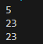

# 02-3 타입 변환

## 핵심 포인트 정리

- **자동 타입 변환**: 값의 표현 범위가 작은 타입에서 큰 타입으로 대입할 때 자동으로 타입이 승격됩니다 (예: byte→int, char→int, int→long, long→float, float→double).  
> 요약: 작은 타입 → 큰 타입은 자동으로 변환

- **강제(명시적) 타입 변환**: 큰 타입 값을 작은 타입 변수에 넣을 때 캐스팅 연산자로 강제 변환합니다. 데이터 손실(오버플로/절삭)이 발생할 수 있습니다.  
> 요약: 큰 타입 → 작은 타입은 (타입)캐스팅 필요, 손실 주의

- **연산식에서의 타입 변환(산술 변환)**: 정수 산술에서 byte/short/char는 연산 시 int로 승격되며, 서로 다른 실수/정수 타입은 더 큰 표현 범위의 타입으로 승격됩니다.  
> 요약: 연산 중에는 더 큰 타입으로 자동 승격

- **문자열 결합(+ 연산)**: 문자열과 + 연산 시 다른 피연산자가 문자열로 변환되어 연결됩니다.  
> 요약: 문자열 + 숫자 = 문자열로 이어붙임

- **문자열 ↔ 기본 타입 변환**: `"10"→10` 등은 `Byte/Short/Integer/Long/Float/Double.parseXxx()`로, 기본 타입→문자열은 `String.valueOf()` 등을 사용합니다.  
> 요약: parseXxx()로 문자열을 숫자로, valueOf()로 숫자를 문자열로

---

## 예제 코드

- [Fixed1Ex.java](../code-examples/02-3/Fixed1Ex.java) - 1번 문제  
- [Fixed2Ex.java](../code-examples/02-3/Fixed2Ex.java) - 2번 문제  
- [Fixed3Ex.java](../code-examples/02-3/Fixed3Ex.java) - 3번 문제  
- [Fixed4Ex.java](../code-examples/02-3/Fixed4Ex.java) - 4번 문제  
- [Fixed5Ex.java](../code-examples/02-3/Fixed5Ex.java) - 5번 문제  
- [Fixed6Ex.java](../code-examples/02-3/Fixed6Ex.java) - 6번 문제  
- [Fixed7Ex.java](../code-examples/02-3/Fixed7Ex.java) - 7번 문제  
- [Fixed8Ex.java](../code-examples/02-3/Fixed8Ex.java) - 8번 문제  
- [Fixed9Ex.java](../code-examples/02-3/Fixed9Ex.java) - 9번 문제  
- [Fixed10Ex.java](../code-examples/02-3/Fixed10Ex.java) - 10번 문제  
- [Fixed11Ex.java](../code-examples/02-3/Fixed11Ex.java) - 11번 문제  

## 실행 결과

-   
-   
-   
-   
-   
-   
-   
-   
-   
-   
-   

---

## 확인 문제

### 1) 자동 타입 변환에 대한 내용입니다. 컴파일 에러가 발생하는 것은 무엇입니까?
```java
byte byteValue = 10;  
char charValue = 'A';
```
① int intValue = byteValue;  
② int intValue = charValue;  
**③ short shortValue = charValue;** 
④ double doubleValue = byteValue;  

**정답: ③**
> 설명: ③char 타입의 양의 허용 범위가 short 타입보다 더 큼

---

### 2) 강제 타입 변환에 대한 내용입니다. 컴파일 에러가 발생하는 것은 무엇입니까?
```java
int intValue = 10;  
char charValue = 'A';  
double doubleValue = 5.7;  
String strValue = "A";
```
① double var = (double) intValue;  
② byte var = (byte) intValue;  
③ int var = (int) doubleValue;  
**④ char var = (char) strValue;**  

**정답: ④**  
> 설명: ④문자열을 char 타입으로 강제 타입 변환(캐스팅)할 수 없음

---

### 3) 연산식에서의 타입 변환에 대한 내용입니다. 컴파일 에러가 발생하는 것은 무엇입니까?
```java
byte byteValue = 10;  
float floatValue = 2.5f;  
double doubleValue = 2.5;
```
**① byte result = byteValue + byteValue;**  
② int result = 5 + byteValue;  
③ float result = 5 + floatValue;  
④ double result = 5 + doubleValue;  

**정답: ①**  
> 설명: ①연산의 결과는 int 타입
---

### 4) 다음 코드에서 컴파일 에러가 발생하는 위치와 이유를 설명하세요.
```java
short s1 = 1;  
short s2 = 2;  
int i1 = 3;  
int i2 = 4;

short result = s1 + s2;  
int result2 = i1 + i2;  
```
**정답: `short result = s1 + s2;`** 
> 설명: `short result = s1 + s2;`의 연산 결과는 short가 아니라 int타입

---

### 5) 알파벳 a의 유니코드는 97이고, b의 유니코드는 98입니다. 따라서 a의 유니코드에 1을 더하면 b의 유니코드가 되므로 다음과 같이 코드를 작성했습니다. 실행결과는 b가 출력되어야 하는데, 컴파일 에러가 발생했습니다. 무엇이 문제이고, 어떻게 수정하면 될까요?
```java
char c1 = 'a';  
char c2 = c1 + 1;  
System.out.println(c2);
```
**정답: `char c2 = (char)(c1 + 1);`** 
> 설명: 연산 결과는 int 타입으로 되어야하는데 char 타입 변수인 c2에 저장해서

---

### 6) 자바에서 '/'는 나눗셈 연산자입니다. x/y는 x를 y로 나누는 연산을 수행합니다. ( )에 들어갈 타입은 무엇이며, 출력되는 결과와 그 이유를 설명해보세요.
```java
int x = 5;  
int y = 2;  
(        )result = x / y;  
System.out.println(result);
```
**정답: int / 2**  
> 설명: 연산 결과는 int타입

---

### 7) 6번 문제에서 출력되는 결과로 2.5가 나오게 하고 싶습니다.(1)~(2)에 들어갈 코드를 작성해보세요.
```java
int x = 5;  
int y = 2;  
(1) result = (2);  
System.out.println(result);
```
**정답: (1)=double, (2)=(double)x / y 또는 x / (double)y 또는 (double)x / (double)y 전부 가능**
> 설명: 피연산자 중 하나또는 모두를 double로 변환해 실수 나눗셈 수행.

---

### 8) 두 실수를 덧셈 연산하고 소수점 이하 자리를 버리고 싶습니다. ( )에 들어갈 코드를 작성해보세요.
```java
double var1 = 3.5;  
double var2 = 2.7;  
int result = ( );  
```
**정답: (int) (var1 + var2)**  
> 설명: 3.5+2.7=6.2 → (int)로 캐스팅해 출력값 6.

---

### 9) var1부터 var4까지 + 연산을 수행해서 int 타입 result 변수에 9가 저장되도록 ( )에 들어갈 코드를 작성해보세요.
```java
long var1 = 2L;  
float var2 = 1.8f;  
double var3 = 2.5;  
String var4 = "3.9";
int result = (              );  
System.out.println(result);
```
**정답: (int)var1 + (int)(var2 + var3) + (int)Double.parseDouble(var4)
또는 (int)(var1 + (int)var2 + var3 + Double.parseDouble(var4))
또는 (int)(var1 + var2 + (int)var3 + Double.parseDouble(var4))
또는 (int)(var1 + var2 + var3 + (int)Double.parseDouble(var4))**
> 설명: (int)var2=1, Double.parseDouble("3.9")=3.9, 2 + 1 + 2.5 + 3.9 = 9.4 → (int)로 출력값 9

---

### 10) 다음 코드를 실행했을 때 출력 결과를 적어보세요.
```java
String str1 = 2 + 3 + "";  
String str2 = 2 + "" + 3;  
String str3 = "" + 2 + 3;
System.out.println(str1);  
System.out.println(str2);  
System.out.println(str3);
```
**정답: 출력값**
```java
5  
23  
23  
```
> 설명: 왼쪽에서부터 평가되며 문자열이 끼면 이후도 문자열이 결합됨

---

### 11) 문자열을 기본 타입으로 변환하려고 합니다.(1)~(4)에 알맞은 코드를 작성해보세요.
```java
byte value = (1);  
int value2 = (2);  
float value3 = (3);  
double value4 = (4);
```
**정답:
(1) = Byte.parseByte
(2) = Integer.parseInt
(3) = Flot.parseFloat
(4) = Double.parseDouble**
 
> 설명: 출력값
10  
1000  
20.5  
3.14159 
