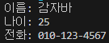
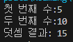
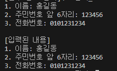
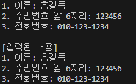

# 02-4 변수와 시스템 입출력

## 핵심 포인트 정리

- **System.out.println()**: 괄호에 주어진 매개값을 모니터로 출력하고 개행을 합니다.  
> 요약: 출력 후 줄바꿈

- **System.out.print()**: 괄호에 주어진 매개값을 모니터로 출력만 하고 개행을 하지 않습니다.  
> 요약: 출력만, 줄바꿈 없음

- **System.out.printf()**: 괄호에 주어진 형식대로 출력합니다.  
> 요약: 형식 지정 출력

- **System.in.read()**: 키보드에서 입력된 키코드를 읽습니다.  
> 요약: 한 글자(키 코드) 읽기

- **Scanner**: `System.in.read()`는 키코드를 하나씩 읽기 때문에 2개 이상의 키가 조합된 한글을 읽을 수 없습니다. 키보드로부터 입력된 내용을 문자열로 읽기 위해서 Scanner를 사용할 수 있습니다.  
> 요약: 문자열 단위 입력은 Scanner 사용

---

## 예제 코드

- [Fixed1Ex.java](../code-examples/chap02_4/Fixed1Ex02_4.java) - 1번 문제  
- [Fixed2Ex.java](../code-examples/chap02_4/Fixed2Ex02_4.java) - 2번 문제  
- [Fixed3Ex.java](../code-examples/chap02_4/Fixed3Ex02_4.java) - 3번 문제  

---

## 실행 결과 - 정상출력 확인

-   
-   
-      
> (입력한 대로 출력  -  입력 안할시 출력X)

---

## 확인 문제

### 1) 다음과 같이 출력되도록 (1) ~ (3)에 들어갈 코드를 작성해보세요.
```java
이름: 감자바
나이: 25
전화: 010-123-4567
```
```java
String name = "감자바";
int age = 25;
String tel1="010", tel2="123", tel3="4567";

System.out.println(1);
System.out.print(2);
System.out.printf(3);
```
**정답:**  
```java
1. System.out.println("이름: " + name);  
2. System.out.print("나이: " + age + "\n");  
3. System.out.printf("전화: %s-%s-%s", tel1, tel2, tel3);  
```
---

### 2) Scanner를 이용해서 키보드로 입력한 두 수를 덧셈하여 결과를 출력하고자 합니다. (1) ~ (4)에 들어갈 코드를 작성해보세요.
```java
Scanner scanner = new Scanner(System.in);

System.out.print("첫 번째 수:");
String strNum1 = 1;

System.out.print("두 번째 수:");
String strNum2 = 2;

int num1 = 3;
int num2 = 4;
int result = num1 + num2;
System.out.println("덧셈 결과: " + result);
```
**정답:**  
```java
1. String strNum1 = scanner.nextLine();  
2. String strNum2 = scanner.nextLine();  
3. int num1 = Integer.parseInt(strNum1);  
4. int num2 = Integer.parseInt(strNum2);  
```
---

### 3) Scanner를 이용해서 이름, 주민번호 앞 6자리, 전화번호를 키보드에서 입력받고 출력하는 코드를 작성해보세요.

```java
[필수 정보 입력]
1. 이름: 
2. 주민번호 앞 6자리:  
3. 전화번호:  

[입력된 내용]
1. 이름: 홍길동
2. 주민번호 앞 6자리: 123456
3. 전화번호: 010-123-1234
```
**정답:**  
```java
Scanner scanner = new Scanner(System.in);

System.out.println("[필수 정보 입력]");

System.out.print("1. 이름: ");  
String name = scanner.nextLine();

System.out.print("2. 주민번호 앞 6자리: ");  
String ssn = scanner.nextLine();

System.out.print("3. 전화번호: ");  
String tel = scanner.nextLine();

System.out.println();  
System.out.println("[입력된 내용]");  
System.out.println("1. 이름: " + name);  
System.out.println("2. 주민번호 앞 6자리: " + ssn);  
System.out.println("3. 전화번호: " + tel);
```


