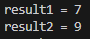

# 03-1 연산자와 연산식

## 핵심 포인트 정리

- **연산자**: 연산의 종류를 결정짓는 기호를 말합니다.  
  연산자의 종류는 산술(+, -, *, /, %), 증감(++, --), 비교(==, !=, <, >, <=, >=), 논리(&&, ||, !), 대입(=, +=, -=, ...) 등이 있습니다.  
> 요약: 연산을 수행하는 기호

- **피연산자**: 연산식에서 연산되는 데이터(값)를 말합니다.  
  예를 들어, 연산식 3 + x 에서는 3과 변수 x가 피연산자입니다.  
> 요약: 연산 대상

- **연산 방향**: 같은 종류 혹은 서로 다른 종류의 연산자가 여러 개 사용될 경우 왼쪽에서 오른쪽으로 또는 오른쪽에서 왼쪽으로 연산 방향이 있습니다.  
  대부분의 연산자는 왼쪽에서 오른쪽으로 연산되지만, 증감(++/--), 부호(+/-), 논리 부정(!), 대입 연산자는 오른쪽에서 왼쪽으로 연산됩니다.  
> 요약: 왼→오 or 오→왼 연산 방향

- **연산 우선순위**: 서로 다른 연산자들이 복합적으로 구성되면 우선적으로 연산되는 연산자가 있습니다.  
  하지만 괄호 ()로 감싸면 연산의 최우선순위를 갖기 때문에 복잡한 연산식에서 연산의 순서를 정하고 싶을 때에는 괄호 ()를 활용하세요.  
> 요약: 우선순위는 괄호 > 그 외 규칙

---

## 표로 정리하는 핵심 포인트

다음은 연산자의 연산 방향과 우선순위를 정리한 표입니다.

| 연산자                            | 연산 방향 | 우선순위 |
|-----------------------------------|-----------|----------|
| 증감(++, --), 부호(+,-), 논리(!)   | ←         | 높음     |
| 산술( *, /, % )                   | →         |          |
| 산술( +, - )                      | →         |          |
| 비교(<, <=, >, >=, instanceof)    | →         |          |
| 비교(==, !=)                      | →         |          |
| 논리(&)                           | →         |          |
| 논리(^)                           | →         |          |
| 논리(ㅣ)                          | →         |          |
| 논리(&&)                          | →         |          |
| 논리(ㅣㅣ)                         | →         |          |
| 조건(?: )                         | →         |          |
| 대입(=, +=, -=, *=, /=, %= ...)   | ←         | 낮음     |

---

## 예제 코드

- [Ex.java](../code-examples/chap03_1/Ex03_1.java) - 연산자 우선순위 비교해보기

## 실행 결과

- 

---
## 확인 문제

### 1) 연산자와 연산식에 대한 설명 중 틀린 것은 무엇입니까? ( )

① 연산자는 피연산자의 수에 따라 단항, 이항, 삼항 연산자로 구분된다.  
② 비교 연산자와 논리 연산자의 산출 타입은 boolean(true/false) 타입이다.  
**③ 연산식은 하나 이상의 값을 산출할 수도 있다.**  
④ 하나의 값이 올 수 있는 자리라면 연산식도 올 수 있다.  

**정답: ③**  
> 설명: 연산식은 반드시 **하나의 값만** 산출합니다.

---

### 2) 연산의 방향과 연산 우선순위에 대한 설명 중 틀린 것은 무엇입니까? ( )

① 산술 연산자(+, -, *, /, %)는 연산 방향이 왼쪽에서 오른쪽으로 수행된다.  
② 대입 연산자(=, +=)는 연산 방향이 오른쪽에서 왼쪽으로 수행된다.  
③ 우선순위와 관계없이 먼저 연산을 하고 싶다면 괄호 ()로 묶어준다.  
**④ 논리 연산자(&&, ||)는 산술 연산보다 우선 수행된다.**  

**정답: ④**  
> 설명: 논리 연산자는 산술 연산보다 **뒤에 수행**됩니다.
