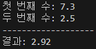
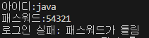

<p align="right"><a href="../readme.md">목차로 이동</a></p>

# 03-2 연산자의 종류

## 핵심 포인트 정리
- 증감 연산자: ++, -- 를 말하며 변수의 값을 1씩 증가, 1씩 감소시킵니다.  
  > 요약: 값을 1 증가/감소
- 비교 연산자: ==, != 등을 말하며 값이 같은지, 다른지를 비교하고 boolean 값을 산출합니다.  
  > 요약: 값의 같음/다름을 비교
- 논리 연산자: &&, ||, ! 등을 말하며 논리곱, 논리합, 논리 부정을 수행하고 boolean 값을 산출합니다.  
  > 요약: 논리식 연산 결과 산출
- 대입 연산자: =, +=, -= 등을 말하며 오른쪽의 값을 왼쪽에 대입하거나 연산 후 대입합니다.  
  > 요약: 연산 후 결과를 변수에 대입
- 삼항 연산자: (조건식) ? A : B 를 말하며 조건이 true이면 A, false이면 B를 산출합니다.  
  > 요약: 조건에 따라 두 값 중 하나 선택

## 예제 코드 - 실행시켜보기
- [확인문제 1](../code-examples/chap03_2/Fixed1Ex03_2.java)  
- [확인문제 2](../code-examples/chap03_2/Fixed2Ex03_2.java)  
- [확인문제 3](../code-examples/chap03_2/Fixed3Ex03_2.java)  
- [확인문제 4](../code-examples/chap03_2/Fixed4Ex03_2.java)  
- [확인문제 5](../code-examples/chap03_2/Fixed5Ex03_2.java)  
- [확인문제 6](../code-examples/chap03_2/Fixed6Ex03_2.java)  
- [확인문제 7](../code-examples/chap03_2/Fixed7Ex03_2.java)  
- [확인문제 8](../code-examples/chap03_2/Fixed8Ex03_2.java)  
- [확인문제 9](../code-examples/chap03_2/Fixed9Ex03_2.java)  
- [확인문제 10](../code-examples/chap03_2/Fixed10Ex03_2.java)  
- [확인문제 11](../code-examples/chap03_2/Fixed11Ex03_2.java)  
- [확인문제 12](../code-examples/chap03_2/Fixed12Ex03_2.java)  
- [확인문제 13](../code-examples/chap03_2/Fixed13Ex03_2.java)  
- [확인문제 14](../code-examples/chap03_2/Fixed14Ex03_2.java)  

## 실행 결과
- 
- 
- 
- 
- 
- 
- 
- 
- 
- 
- 
- 
- 
- 
 

## 확인 문제
### 1) 다음 코드에서 컴파일 에러가 발생하는 위치와 이유를 설명해보세요.  
```java
byte b = 5;  
b = -b;  
int result = 10 / b;  
System.out.println(result);  
```
**정답: b = -b;**  
> 설명: 부호 연산을 하면 결과는 int 타입이 되는데 byte에 대입할 수 없어 에러 발생

---

### 2) 다음 코드를 실행했을 때 출력 결과는 무엇입니까?  
```java
int x = 10;  
int y = 20;  
int z = (++x) + (y--);  
System.out.println(z);  
```
**정답: 31**  
> 설명: x는 11, y는 19가 되어 11+20=31 출력

---

### 3) 다음 코드에서 stop이 true일 때 반복을 멈추고 싶습니다. 참고로 while(조건식) {}은 조건식이 true가 될 때 { } 안의 실행문을 반복해서 실행합니다. ______ 에 들어갈 알맞은 조건식을 작성해보세요.  
```java
boolean stop = ...;  
while( ______ ) {  
}  
```
**정답: !stop**  
> 설명: stop이 true일 때 while문이 종료되도록 조건은 !stop이어야 함

---

###  4) 534자의 연필을 30명의 학생들에게 똑같은 개수로 나누어 줄 때 1인당 몇 개를 가지 수 있고, 몇 개가 남는지를 구하는 코드입니다. ①, ②에 들어갈 알맞은 코드를 작성하세요.  
```java
int pencils = 534;  
int students = 30;  

// 학생 1명이 가지는 연필 개수  
int pencilsPerStudent = ( ① );  
System.out.println(pencilsPerStudent);  

// 남은 연필 개수  
int pencilsLeft = ( ② );  
System.out.println(pencilsLeft);  
```
**정답: ① pencils / students, ② pencils % students**  
> 설명: 몫은 나눈 수, 나머지는 남은 개수를 나타냄

---

### 5) 다음 코드를 실행하면 출력 결과로 5를 기대했는데 4가 출력되었습니다. 어디에서 잘못 작성된 것일까요?  
```java
int var1 = 5;  
int var2 = 2;  
double var3 = var1 / var2;  
int var4 = (int) (var3 * var2);  
System.out.println(var4);  
```
**정답: var1 / var2**  
> 설명: int 나눗셈이라 결과가 2.0이 되어 var4는 4로 계산됨

---

### 6) 다음은 십의 자리 이하를 버리는 코드입니다. 변수 value의 값이 356이라면 300이 나올 수 있도록 ______ 에 알맞은 코드를 작성하세요(산술 연산자만 사용).  
```java
int value = 356;  
System.out.println( ______ );  
```
**정답: value / 100 * 100**  
> 설명: 356을 100으로 나누면 3, 다시 100을 곱해 300 출력

---

### 7) 다음 코드를 실행했을 때 출력 결과로 "10%입니다."를 기대했는데 "10%가 아닙니다."가 출력되었습니다. 어디에서 잘못 작성된 것일까요?  
```java
float var1 = 10f;  
float var2 = var1 / 100;  
if(var2 == 0.1) {  
    System.out.println("10%입니다.");  
} else {  
    System.out.println("10%가 아닙니다.");  
}  
```
**정답: if 비교식이 잘못됨**  
> 설명: float 계산 결과는 정확히 0.1이 아니므로, 비교식이 false가 됨

---

### 8) 다음 코드는 사다리꼴의 넓이를 구하는 코드입니다. 정확히 소수 자릿수가 나올 수 있도록 ______ 에 알맞은 코드를 작성하세요.  
```java
int lengthTop = 5;  
int lengthBottom = 10;  
int height = 7;  
double area = ( ______ );  
System.out.println(area);  
```
**정답: (lengthTop + lengthBottom) * height / 2.0**  
> 설명: 사다리꼴 넓이 공식 적용

---

### 9) 키보드로 두 실수를 다음과 같이 입력받습니다(Scanner 이용). 입력된 첫 번째 수에 두 번째 수를 나눈 결과를 "결과:값"으로 출력하고, 두 번째 수에 0.0이 입력되었을 경우 "결과:무한대"가 출력되도록 코드를 작성하세요(Scanner의 next() 사용).  
```java
첫 번째 수: 7.3 Enter  
두 번째 수: 2.5 Enter  
결과: 2.92 (or 결과:무한대)  
```
**정답: Scanner 활용 코드 작성**  
> 설명: if(num2 != 0.0)일 때만 나눗셈 수행, 아니면 무한대 출력

---

### 10) 반지름이 10인 원의 넓이를 구하는데 다음과 같이 var2.".", var3을 + 연산해서 원주율(ㅠ)을 얻은 다음 계산하려고 합니다. 올바른 결과가 나오도록 코드를 수정해보세요.
```java
int var1 = 10;  
int var2 = 3;  
int var3 = 14;  
double var4 = var1 * var1 * var2 * var3;  
System.out.println("원의 넓이: " + var4);  
```
**정답: var2, var3를 double로 변환하여 3.14로 계산해야 함** 
```java
int var1 = 10;
int var2 = 3;
int var3 = 14;
double var4 = var1 * var1 * Double.parseDouble(var2 + "." + var3);
System.out.println("원의 넓이: " + var4);
```
> 설명: 정수 곱셈으로 3*14=42가 되어 잘못된 결과 발생

---

### 11) 키보드로 아이디와 패스워드를 입력받습니다. 입력 조건으로 이름은 문자열이고 패스워드는 정수입니다(패스워드는 int 타입으로 변환). 입력된 내용을 비교해 아이디가 "java"이고 패스워드가 12345라면 "로그인 성공"을 출력하고 그렇지 않으면 "로그인 실패"를 출력하도록 ① ②에 알맞은 코드를 작성하세요.
```java
Scanner scanner = new Scanner(System.in);

System.out.print("아이디:");
String name = scanner.nextLine();

System.out.print("패스워드:");
String strPassword = scanner.nextLine();
int password = Integer.parseInt(strPassword);

if( ① ) {
    if( ② ) {
        System.out.println("로그인 성공");
    } else {
        System.out.println("로그인 실패: 패스워드가 틀림");
    }
} else {
    System.out.println("로그인 실패: 아이디 존재하지 않음");
}
```
**정답: ① name.equals("java"), ② password == 12345**
> 설명: 문자열 비교는 `==`가 아니라 `equals()`로 해야 하고, 비밀번호는 정수 비교 연산 `==`로 검사합니다.
---

### 12) 다음 코드는 비교 연산자와 논리 연산자의 복합 연산식입니다. 연산식의 출력 결과를 괄호 ( ) 속에 넣으세요.  
```java
int x = 10;  
int y = 5;  
System.out.println( (x>7) && (y<=5) ); ( )  
System.out.println( (x%3 == 2) || (y%2 != 1) ); ( )  
```
**정답: true, false**  
> 설명: 첫 조건은 모두 참, 두 번째 조건은 모두 거짓

---

### 13) 대입 연산자(=)와 산술 연산자(+, -, *, /)로 구성된 실행문을 대입 연산자 하나로 구성된 실행문으로 변경해보세요.  
```java
int value = 0;  
value = value + 10; ( )  
value = value - 10; ( )  
value = value * 10; ( )  
value = value / 10; ( )  
```
**정답: value += 10; value -= 10; value `*= 10`; value /= 10;**  
> 설명: 대입 연산자를 사용해 축약 가능

---

### 14) 다음 코드를 실행했을 때 출력 결과는 무엇입니까?  
```java
int score = 85;  
String result = (!(score>90)) ? "가" : "나";  
System.out.println(result);  
```
**정답: 가**  
> 설명: 조건식은 false → !(false)=true → “가” 출력
<p align="right"><a href="#top">위로 이동</a> 