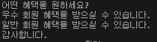

<p align="right"><a href="../readme.md">목차로 이동</a></p>

# 04-1 조건문: if문, switch문

## 핵심 포인트
- **if문**: `if(조건식) { ... }` — 조건식이 true면 블록을 실행합니다.  
  > 요약: 조건이 참일 때만 실행

- **if-else문**: `if(조건식) { ... } else { ... }` — 조건식이 true면 if 블록, false면 else 블록을 실행합니다.  
  > 요약: 참이면 if, 거짓이면 else

- **if-else if-else문**: `if(조건1) { ... } else if(조건2) { ... } else { ... }` — 위에서부터 순차적으로 검사하고, 모두 false면 else를 실행합니다.  
  > 요약: 위에서부터 순서대로 검사 후 마지막엔 else

- **switch문**: `switch(변수) { case 값1: ...; break; case 값2: ...; break; default: ...; }` — 변수의 값과 일치하는 case를 실행하고, 없으면 default를 실행합니다.  
  > 요약: 값에 따라 해당 case 실행, 없으면 default
  
## 예제 코드
- [확인 문제 3.java](../code-examples/chap04_1/Fixed3Ex04_1.java)
- [확인 문제 4.java](../code-examples/chap04_1/Fixed4Ex04_1.java)

## 실행 결과
- 
- 

## 확인 문제

### 1) 조건문의 종류를 빈칸에 넣어보세요.
- 조건문: (      ), (      )

**정답:** if문, switch문
> 해설: 자바의 대표적인 조건문은 if 계열(if, if-else, if-else if-else)과 switch문입니다.

---

### 2) 조건문을 설명한 것 중 맞는 것에 O표, 틀린 것에 X표 하세요.
1. if문은 조건식의 결과에 따라 실행 흐름을 달리할 수 있다. ( O )  
2. if문은 조건식이 true이면 블록을 실행하고 false이면 블록을 실행하지 않는다. ( O )  
3. if문의 블록 내부에는 또 다른 if문을 사용할 수 있다. ( O )  
4. switch문에서 사용할 수 있는 변수의 타입은 int만 가능하다. ( X )

**정답:** O, O, O, X
> 해설: (4) switch 피연산자는 `byte, short, char, int, enum, String`(JDK 7+) 등이 가능.

---

### 3) 다음 코드를 실행했을 때 출력되는 내용을 적어보세요.
```java
int score = 85;
System.out.print("등급은 ");
if(score < 70) {
    System.out.print("D");
} else if(score < 80) {
    System.out.print("C");
} else if(score < 90) {
    System.out.print("B");
} else {
    System.out.print("A");
}
System.out.println("입니다.");
```
**정답:** 등급은 B입니다. 
> 해설: score=85 는 80 ≤ score < 90 구간에 해당하므로 'B' 출력.

---

### 4) 다음 코드를 실행했을 때 출력되는 내용을 적어보세요.
```java
System.out.println("어떤 혜택을 원하세요?");
char grade = 'C';
switch(grade) {
case 'A': System.out.println("VIP 회원은 드릴 수 있습니다."); break;
case 'B': System.out.println("VIP 혜택을 받으실 수 있습니다."); break;
case 'C': System.out.println("우수 회원 혜택을 받으실 수 있습니다.");
case 'D': System.out.println("일반 회원 혜택을 받으실 수 있습니다."); break;
default: System.out.println("혜택이 없습니다.");
}
System.out.println("감사합니다.");
```
**정답:**  
어떤 혜택을 원하세요?  
우수 회원 혜택을 받으실 수 있습니다.  
일반 회원 혜택을 받으실 수 있습니다.  
감사합니다.  

> 해설: grade='C' 에서 **break가 없으므로** 'C' 이후 **fall-through**로 'D'까지 실행된 뒤 break로 종료됩니다.
<p align="right"><a href="#top">위로 이동</a> 