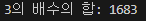
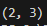
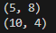
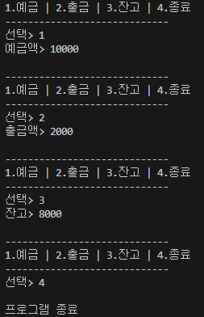

# 04-2 반복문: for문, while문, do-while문

## 핵심 포인트
- **for문**: `for(초기화; 조건식; 증감식) { ... }` — 조건식이 true인 동안 블록을 반복 실행하며, 각 반복 뒤에 증감식이 수행됩니다.
  > 요약: 정해진 횟수를 반복할 때 가장 적합

- **while문**: `while(조건식) { ... }` — 조건식이 true인 동안 반복합니다.
  > 요약: 조건 중심 반복(선검사)

- **do-while문**: `do { ... } while(조건식);` — 블록을 먼저 1회 실행한 뒤 조건식이 true면 반복합니다.
  > 요약: 최소 1회는 실행(후검사)

- **break문**: for/while/do-while 내부에서 반복을 즉시 종료합니다.
  > 요약: 반복 강제 종료

- **continue문**: 반복문 내부에서 실행되면 아래 코드를 건너뛰고 다음 반복으로 넘어갑니다.
  > 요약: 이번 턴 스킵

## 예제 코드
- [확인 문제 2.java](../code-examples/chap04_2/Fixed2Ex04_2.java)
- [확인 문제 3.java](../code-examples/chap04_2/Fixed3Ex04_2.java)
- [확인 문제 4.java](../code-examples/chap04_2/Fixed4Ex04_2.java)
- [확인 문제 5.java](../code-examples/chap04_2/Fixed5Ex04_2.java)
- [확인 문제 6.java](../code-examples/chap04_2/Fixed6Ex04_2.java)
- [확인 문제 7.java](../code-examples/chap04_2/Fixed7Ex04_2.java)

## 실행 결과
- 
- 
- 
- 
- 
- 

## 확인 문제

### 1) 반복문의 종류를 빈칸에 적어보세요.
- 반복문: (      ), (      ), (      )

**정답 :** for문, while문, do-while문  
> 해설: 자바의 대표적 반복문 3종입니다.

---

### 2) for문을 이용해서 1부터 100까지의 정수 중에서 3의 배수의 총합을 구하는 코드를 작성해보세요.

**정답 :** (예시 코드)  
```java
package sec02.verify.exam02;
public class Exam02 {
    public static void main(String[] args) {
        int sum = 0;
        for (int i = 1; i <= 100; i++) {
            if (i % 3 == 0) {
                sum += i;
            }
        }
        System.out.println("3의 배수의 합: " + sum);
    }
}
```
> 해설: 3의 배수 판정 `i % 3 == 0` 로 누적.

---

### 3) while문과 Math.random() 메서드를 이용해서 2개의 주사위를 던졌을 때 나오는 눈을 (눈1, 눈2) 형태로 출력하고, 눈의 합이 5가 아니면 계속 주사위를 던지고, 합이 5이면 실행을 멈추는 코드를 작성해보세요.  
`합이 5가 되는 조합: (1,4), (4,1), (2,3), (3,2)`

**정답 :** (예시 코드)  
```java
package sec02.verify.exam03;
public class Exam03 {
    public static void main(String[] args) {
        while (true) {
            int num1 = (int)(Math.random() * 6) + 1;
            int num2 = (int)(Math.random() * 6) + 1;
            System.out.println("(" + num1 + ", " + num2 + ")");
            if ((num1 + num2) == 5) {
                break;
            }
        }
    }
}
```
> 해설: 무한루프 + 합이 5일 때 break.

---

### 4) 중첩 for문을 이용하여 방정식 `4x + 5y = 60`의 모든 해를 구해서 `(x, y)` 형태로 출력해보세요. 단, x와 y는 10 이하의 자연수입니다.

**정답 :** (예시 코드)  
```java
package sec02.verify.exam04;
public class Exam04 {
    public static void main(String[] args) {
        for (int x = 1; x <= 10; x++) {
            for (int y = 1; y <= 10; y++) {
                if ((4 * x + 5 * y) == 60) {
                    System.out.println("(" + x + ", " + y + ")");
                }
            }
        }
    }
}
```
> 해설: 완전탐색으로 조건 만족 쌍만 출력.

---

### 5) for문을 이용해서 다음과 같이 `*`을 출력하는 코드를 작성해보세요.
```
*
**
***
****
```
**정답 :** (예시 코드)  
```java
package sec02.verify.exam05;
public class Exam05 {
    public static void main(String[] args) {
        for (int i = 1; i < 5; i++) {
            for (int j = 1; j <= i; j++) {
                System.out.print("*");
                if (j == i) {
                    System.out.println();
                }
            }
        }
    }
}
```
> 해설: 행 i에 대해 열 j를 1..i 까지 출력, 줄바꿈은 j==i에 맞춰 처리.

---

### 6) for문을 이용해서 다음과 같이 `*`을 출력하는 코드를 작성해보세요.
```
   *
  **
 ***
****
```
**정답 :** (예시 코드)  
```java
package sec02.verify.exam06;
public class Exam06 {
    public static void main(String[] args) {
        for (int i = 1; i < 5; i++) {
            for (int j = 4; j > 0; j--) {
                if (i < j) {
                    System.out.print(" ");
                } else {
                    System.out.print("*");
                }
            }
            System.out.println();
        }
    }
}
```
> 해설: 공백/별의 개수를 조건으로 분기하여 오른쪽 정렬.

---

### 7) while문과 Scanner를 이용해서 키보드로 입력된 데이터로 예금, 출금, 조회, 종료 기능을 제공하는 코드를 작성하세요. (Scanner의 `nextLine()` 사용)

**정답 :** (예시 코드)  
```java
package sec02.verify.exam07;
import java.util.Scanner;
public class Exam07 {
    public static void main(String[] args) {
        boolean run = true;

        int balance = 0;
        Scanner scanner = new Scanner(System.in);

        while (run) {
            System.out.println("-----------------------------");
            System.out.println("1.예금 | 2.출금 | 3.잔고 | 4.종료");
            System.out.println("-----------------------------");
            System.out.print("선택> ");

            int menuNum = Integer.parseInt(scanner.nextLine());

            switch (menuNum) {
                case 1:
                    System.out.print("예금액> ");
                    balance += Integer.parseInt(scanner.nextLine());
                    break;
                case 2:
                    System.out.print("출금액> ");
                    balance -= Integer.parseInt(scanner.nextLine());
                    break;
                case 3:
                    System.out.println("잔고> " + balance);
                    break;
                case 4:
                    run = false;
                    break;
            }
            System.out.println();
        }
        System.out.println("프로그램 종료");
    }
}
```
> 해설: 문자열로 입력받아 정수로 변환(`Integer.parseInt`)하고 switch로 메뉴 분기.
