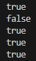

<p align="right"><a href="../readme.md">목차로 이동</a></p>

# 05-1 참조 타입과 참조 변수

## 핵심 포인트
- 기본 타입: byte, short, char, int, long, float, double, boolean — 변수에 값 자체가 저장됩니다.
  > 값 자체 저장(스택 로컬 등)

- 참조 타입: 배열, 열거, 클래스, 인터페이스 — 변수에 객체의 주소(참조)가 저장됩니다.
  > 객체를 가리키는 주소 저장

- 메모리 사용 영역(JVM): 메소드 영역(클래스/정적/상수/코드), 힙(객체), 스택(변수/프레임).
  > 코드·정적 → 메소드 / 객체 → 힙 / 변수 → 스택

- 변수 비교: ==, != 는 기본 타입은 값 비교, 참조 타입은 참조(번지) 비교입니다.
  > 같은 객체를 가리키면 == 가 true

- null: 어떤 객체도 참조하지 않음을 의미. 참조 변수는 null로 초기화 가능(스택에 존재).
  > “비어있는 참조”

- NullPointerException: null 참조로 필드/메소드 접근 시 발생.
  > null.something() → NPE

## 예제 코드 링크
- [확인 문제 5.java](../code-examples/chap05_1/Fixed5Ex05_1.java)

## 실행 결과
- 

## 확인 문제

### 1) 참조 타입에 대한 설명입니다. 맞는 것에 O표, 틀린 것에 X표 하세요.
1. 참조 타입에는 배열, 열거, 클래스, 인터페이스가 있다. (   )
2. 참조 변수의 메모리 생성 위치는 스택이다. (   )
3. 참조 타입에서 ==, != 연산자는 객체 번지를 비교한다. (   )
4. 참조 변수는 null 값으로 초기화할 수 없다. (   )

정답 : O, O, O, X
해설: (2) 참조 “변수”는 스택, “객체”는 힙에 생성. (4) 참조 변수는 null로 초기화 가능.

---

### 2) 자바에서 메모리 사용에 대한 설명 중 맞는 것에 O표, 틀린 것에 X표 하세요.
1. 로컬 변수는 스택 영역에 생성되며 실행 블록이 끝나면 소멸된다. (   )
2. 상수, 메소드 코드, 생성자 코드는 메소드 영역에 생성된다. (   )
3. 참조되지 않은 객체는 프로그램에서 직접 소멸 코드를 작성하는 것이 좋다. (   )
4. 배열 및 객체는 힙 영역에 생성된다. (   )
5. 스택 영역에는 객체 인스턴스가 생성된다. (   )
6. 정적(static) 필드와 상수는 메소드 영역에 저장된다. (   )

정답 : O, O, X, O, X, O
해설: (3) 소멸은 GC 담당. (5) 객체는 힙에 생성.

---

### 3) String 타입에 대한 설명 중 맞는 것에 O표, 틀린 것에 X표 하세요.
1. String은 클래스이므로 참조 타입이다. (   )
2. 문자열의 비교는 == 를 사용해야 한다. (   )
3. 동일한 문자 리터럴을 저장하는 변수는 동일한 String 객체를 참조한다. (   )
4. new String("문자열") 은 무조건 새로운 String 객체를 생성한다. (   )

정답 : O, X, O, O
해설: (2) 내용 비교는 equals. (3) 리터럴은 상수 풀 공유. (4) new 는 항상 새 객체.

---

### 4) 참조 변수에 대한 설명입니다. 맞는 것에 O표, 틀린 것에 X표 하세요.
1. 참조 변수에 저장되는 것은 객체의 번지이다. (   )
2. 참조 변수에 null이 저장되면 어떤 객체도 참조하지 않는다. (   )
3. 참조 변수에 null이 저장된 상태에서는 객체를 사용할 수 없다. (   )
4. NullPointerException은 초기화되지 않은 참조 변수에서 발생한다. (   )

정답 : O, O, O, X
해설: NPE는 “초기화 안 됨”이 아니라 null을 사용했을 때 발생. (초기화되지 않은 지역 변수는 컴파일 자체가 안 됩니다.)

---

### 5) 다음 코드를 보고 비교 연산식과 메소드의 실행결과를 빈칸에 기술하세요.
```java
int var1 = 10;
int var2 = 10;
String var3 = "AB";
String var4 = "AB";
String var5 = new String("AB");
```
```java
1. var1 == var2 (   )
2. var1 != var2 (   )
3. var3 == var4 (   )
4. var3 != var5 (   )
5. var4.equals(var5) (   )
```
정답 :
1) true, 2) false, 3) true, 4) true, 5) true
해설: (3) 리터럴은 상수 풀 공유 → 같은 객체. (4) new 는 다른 객체. (5) equals 는 내용 비교.

---

<p align="right"><a href="#top">위로 이동</a> 
